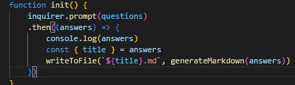

## ReadMe Generator

## Description

This project allows the user to create a baisc ReadMe file through inputs in terminal, with the help of node, inquirer and FS. The user can follow input questions run in the terminal and a ReadMe will be Generated by the end.

---

Here's a few quick links:

* [Installation](#installation)
* [Code Snippets](#code-snippets)
* [Usage](#usage)
* [Technology used](#technology-used)
* [learning Points](#learning-points)
* [Credits](#credits)
* [License](#license)
* [Author](#author)
---

## Installation & Usage

1. Navigate to the [GitHub Repository](https://github.com/fiaschettima/ReadMeGenerator) containing the ReadMe Generator files.
2. Clone the Repository to your computer
3. In terminal navigate to the cloned Repository
`
cd ReadMeGenerator
`
4. After navigatiing to the file in terminal enter the command:
`
node index.js
`
5. Fill out prompts in Terminal and a Readme Will then be Created with file name of the project title Input
 

---

## Code Snippets

This snippet of code is how the page is initialized when `node index.js` is ran in the terminal. Inquirer prompts all questions in the questions array, then the answers are used to write the readme file. The file name is taken from the answers object with a key of title and the content is generated by sending the answers information to the generateMarkdown function.

---

## Technology Used
    
    Javascript
    Node

---

## Learning Points
    
    This project provided experience using Javascript with node and npm packages such as inquirer and fs. As well as taking the response and using template literals to use these prompts from inquirer.

---

## License

    MIT License
---
## Author
    
    Matthew Fiaschetti 
[Github Profile](https://github.com/fiaschettima)
